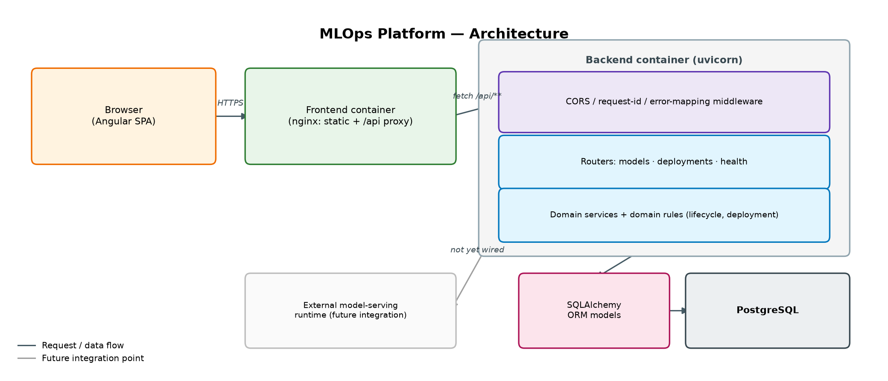
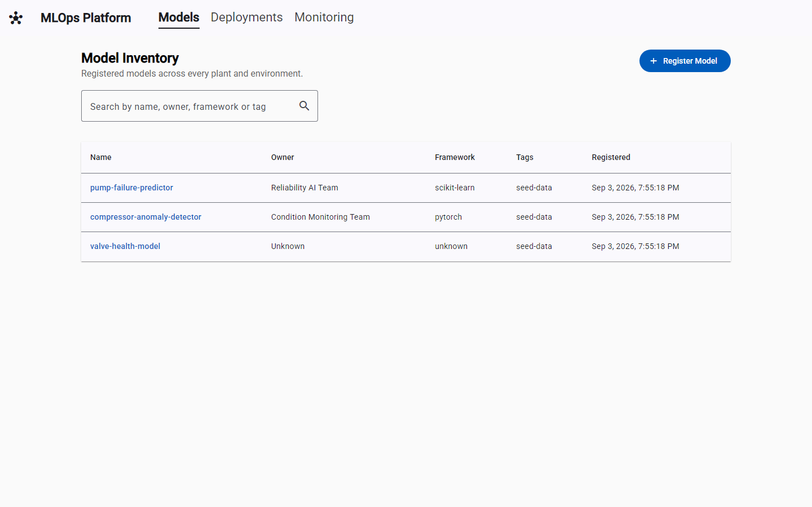
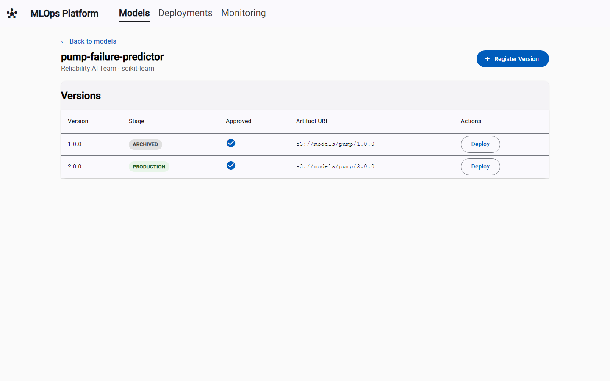
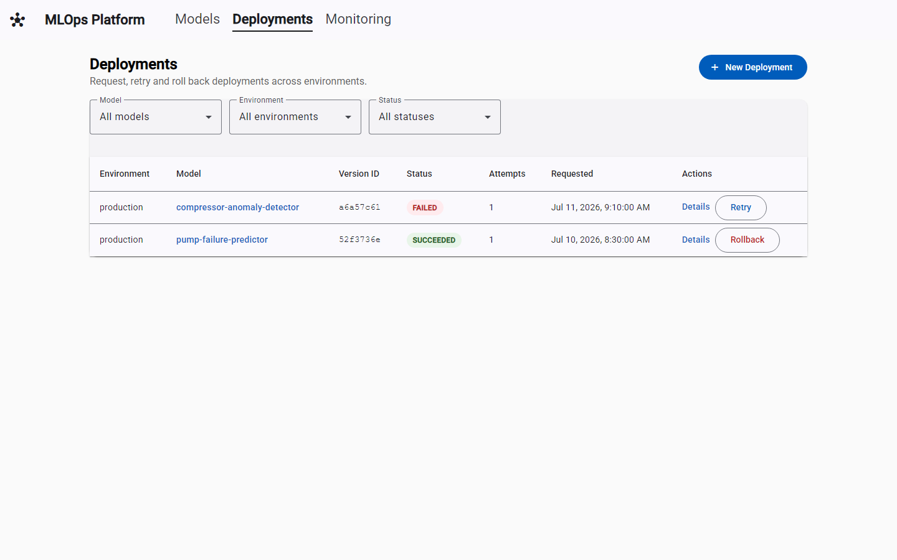
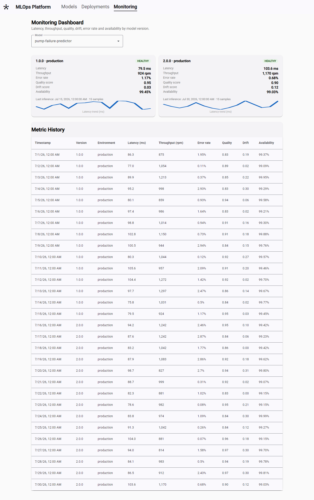
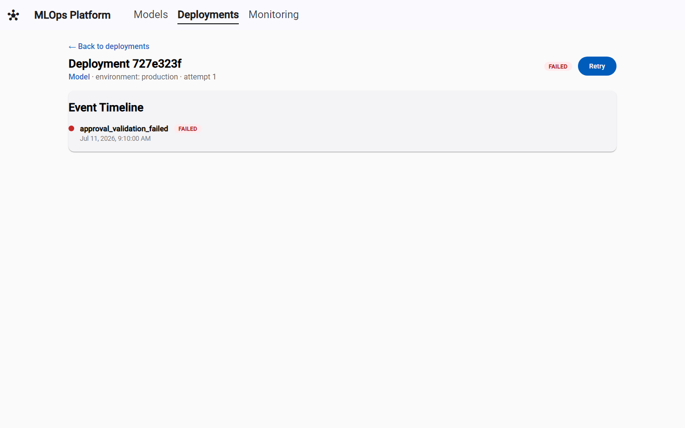

# MLOps Platform

**Role level: G13 — Senior Software Engineer**

A full-stack platform for registering, versioning, approving, deploying, monitoring and rolling
back machine-learning models across environments — built as a technical assignment submission.

## Problem Statement

An industrial organization runs many ML models across plants and environments. Teams need one place
to: register a model and its versions, gate promotion behind approval, request a deployment to
staging/production, watch its operational health (latency, throughput, error rate, quality, drift,
availability), retry a failed deployment, and roll back a bad production release — all with a
Python REST API and an Angular operational UI. Full brief:
[`docs/assignment-pack/01_assignment_brief.md`](docs/assignment-pack/01_assignment_brief.md).

## Architecture Summary

Angular SPA → nginx (static + `/api` reverse proxy) → FastAPI → domain services/rules → SQLAlchemy →
PostgreSQL (SQLite for local dev/tests). Full write-up, diagram and domain model:
[`docs/architecture.md`](docs/architecture.md).



## Technology Stack

| Layer | Choice |
|---|---|
| Backend | Python 3.11, FastAPI, Pydantic v2, SQLAlchemy 2.0, Uvicorn |
| Database | PostgreSQL 16 (Docker), SQLite (local dev / tests) |
| Frontend | Angular 18 (standalone components), Angular Material, RxJS, TypeScript |
| Testing | Pytest + coverage (backend), Karma/Jasmine (frontend) |
| Packaging | Docker, Docker Compose, GitHub Actions CI |

Rationale for each choice: [`docs/adr/`](docs/adr/).

## Project Structure

```text
.
├── backend/            FastAPI app, domain services, SQLAlchemy models, pytest suite
├── frontend/           Angular app (standalone components, Angular Material)
├── data/               Sample registry / metrics / deployment-event data used by the seed script
├── scripts/seed_data.py  Loads data/ into the database for a populated demo
├── docs/               Architecture, API design, test strategy, ADRs, known limitations, screenshots
├── docker-compose.yml  backend + frontend + postgres
└── .github/workflows/ci.yml
```

## Setup & Run

### Option A — Docker Compose (recommended)

```bash
docker compose up --build
```

This starts PostgreSQL, the FastAPI backend (`:8000`) and the Angular frontend served by nginx
(`:4200`, proxying `/api/*` to the backend). Then seed some demo data:

```bash
docker compose exec backend python scripts/seed_data.py
```

Open **http://localhost:4200**.

### Option B — Run locally without Docker

Backend:

```bash
cd backend
python -m venv .venv && source .venv/bin/activate   # .venv\Scripts\activate on Windows
pip install -r requirements.txt
uvicorn app.main:app --reload --port 8000
```

Seed demo data (in the same virtualenv, from the repo root):

```bash
python scripts/seed_data.py
```

Frontend (in a second terminal):

```bash
cd frontend
npm ci
npx ng serve
```

Open **http://localhost:4200** — the dev server proxies `/api/*` to `http://localhost:8000`
(`frontend/src/proxy.conf.json`).

A `Makefile` wraps the commands above (`make backend-install`, `make backend-run`,
`make frontend-install`, `make frontend-run`, `make seed`, `make up`).

## Test Commands

```bash
# Backend: unit + integration tests with coverage
cd backend && python -m pytest

# Backend: lint
cd backend && ruff check app tests

# Frontend: unit tests (headless Chrome)
cd frontend && npx ng test --watch=false --browsers=ChromeHeadless
```

44 backend tests / 19 frontend tests pass as of this submission; see
[`docs/test-strategy.md`](docs/test-strategy.md) for what each suite covers.

## API Documentation

With the backend running: **http://localhost:8000/docs** (Swagger UI) or **/redoc**. Design notes
and error-shape conventions: [`docs/api-design.md`](docs/api-design.md).

## Screenshots

| Model Inventory | Model Detail |
|---|---|
|  |  |

| Deployments | Monitoring Dashboard |
|---|---|
|  |  |

| Deployment Detail / Event Timeline |
|---|
|  |

## Sample Workflows

With the seed data loaded (`scripts/seed_data.py`), from the Angular UI or via `curl`:

1. **Register → approve → deploy**: open a model → "Register Version" → "Approve" → "Deploy" (or
   `POST /models/{id}/versions`, then `.../approve`, then `POST /deployments`).
2. **Block an unapproved deploy**: try deploying a `DRAFT`/unapproved version to `production` — the
   UI surfaces the `422 LIFECYCLE_ERROR` message inline.
3. **Retry a failure**: create a deployment with "Simulate a failure" checked, then hit **Retry** on
   it from the Deployments list or its detail page.
4. **Roll back production**: deploy a second version to `production`, then **Rollback** — the
   previous version is re-promoted and the event timeline records both deployments.
5. **Monitor**: the Monitoring Dashboard shows per-version/environment health derived from
   latency/error-rate/drift/quality/availability, with a latency sparkline and full history table.

## Known Limitations

No auth, no async worker (the deploy pipeline runs synchronously — see
[ADR-0004](docs/adr/0004-synchronous-deployment-simulation.md)), no real model-serving integration,
schema managed via `create_all` rather than migrations (see
[ADR-0003](docs/adr/0003-schema-management.md)). Full list:
[`docs/known-limitations.md`](docs/known-limitations.md).

## Future Improvements

OAuth2/OIDC + role-scoped deploy permissions, a real task queue for the deploy pipeline, Alembic
migrations, a metrics-ingestion endpoint, API versioning, browser-level E2E tests. Details:
[`docs/known-limitations.md`](docs/known-limitations.md#future-improvements).
