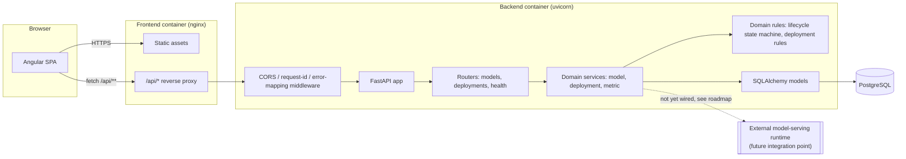
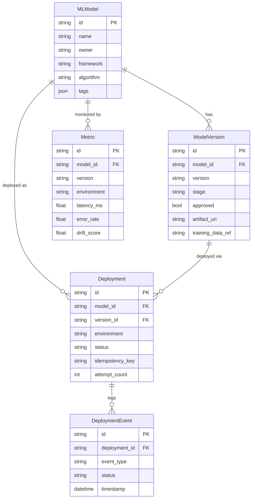

# Architecture

## Context

Industrial organizations run many ML models across plants and environments. Teams need a single
place to register models and versions, gate promotion behind approval, deploy to staging/production,
watch operational health, and roll back safely when something goes wrong. This platform provides
that as a small full-stack application: a FastAPI backend for the domain and REST API, and an
Angular GUI for the operational views.

## Scope

In scope: model/version registry, lifecycle approval, deployment request/retry/rollback, monitoring
data display, and the Angular views to drive all of it. Out of scope (see
[known-limitations.md](known-limitations.md)): real model serving, auth/authz, an async job queue,
and multi-tenancy.

## Architecture Overview

There is no authentication boundary yet — the diagram's dashed line marks where a model-serving
runtime integration and an auth gateway would sit in a production deployment (see Security below).
The current "worker/queue" role is filled by the deployment pipeline running synchronously inside
the request (see [ADR-0004](adr/0004-synchronous-deployment-simulation.md)); the diagram shows where
an actual async worker would be introduced.

## Components

- **Angular SPA** (`frontend/`): standalone components, lazy-loaded routes per feature area, Angular
  Material for layout/inputs, RxJS-backed services, a small `Resource<T>` utility that turns any
  on-demand HTTP call into loading/error/data signals for the template.
- **FastAPI app** (`backend/app/main.py`): CORS, a request-id + timing logging middleware, and a
  single exception handler that converts every domain error into the same JSON error shape.
- **Domain services** (`backend/app/services/`): `model_service`, `deployment_service`,
  `metric_service` — all business logic lives here, not in the routers, so it is unit- and
  integration-testable without HTTP.
- **Domain rules** (`backend/app/domain/`): the lifecycle state machine and deployment
  eligibility/retry/rollback rules, factored out so they can be unit-tested in isolation with plain
  Python objects (see `tests/unit/`).
- **Persistence** (`backend/app/models/`): SQLAlchemy 2.0 ORM models, one table per aggregate
  (models, model_versions, deployments, deployment_events, metrics).
- **PostgreSQL**: the system of record in Docker Compose; SQLite is used for local dev and tests
  for zero-setup iteration (see [ADR-0002](adr/0002-persistence-choice.md)).

## Domain Model

## Key Workflows

**Register → approve → deploy**
1. `POST /models` creates a model; `POST /models/{id}/versions` registers a version at `DRAFT`.
2. `POST /models/{id}/versions/{version_id}/approve` walks `DRAFT → VALIDATED → APPROVED`.
3. `POST /deployments` validates the version is approved and sufficiently promoted for the target
   environment, then runs the deploy pipeline synchronously (`REQUESTED → VALIDATING → DEPLOYING →
   SUCCEEDED|FAILED`), promoting the version's stage to `STAGING`/`PRODUCTION` on success.

**Retry**: only a `FAILED` deployment can be retried; retry re-validates and re-runs the same
pipeline, incrementing `attempt_count`.

**Rollback**: only a `SUCCEEDED` deployment can be rolled back, and only if an earlier `SUCCEEDED`
deployment exists for the same model+environment. Rollback demotes the current version to `STAGING`
and re-promotes the previous version — no new deployment row is created, matching "rollback" as an
operation on the current deployment rather than a new deploy.

**Idempotent deploy requests**: a client-supplied `idempotency_key` makes a repeated `POST
/deployments` return the original deployment instead of creating a duplicate; independent of that,
a second request for the same model+version+environment while one is still in flight is rejected
with `409 CONFLICT`.

## Reliability

- Every domain error maps to a stable `{ "error": { code, message, details } }` shape and the
  correct HTTP status (`404`, `409`, `422`, `400`) — see [api-design.md](api-design.md).
- The deployment pipeline runs inside the request/DB transaction, so a `FAILED` outcome is committed
  atomically with its event log; there's no partial state between "requested" and "failed".
- Duplicate protection is enforced at the service layer against the database, not just in the UI.

## Security

Not implemented in this assignment: authentication, authorization, per-environment RBAC (e.g. who
may deploy to production), and secrets management beyond environment variables. See
[known-limitations.md](known-limitations.md) and the roadmap for how this would be layered in
(API gateway + OAuth2/OIDC in front of the FastAPI app, environment-scoped roles enforced in
`deployment_service`).

## Observability

- Structured request logging (method, path, status, duration, request id) via a single ASGI
  middleware, plus per-action `logger.info` calls in the routers.
- `GET /health` checks DB connectivity and returns `ok`/`degraded`, suitable for a container
  healthcheck (wired into both Dockerfiles) or a load-balancer probe.
- The monitoring dashboard surfaces the same "is this model healthy" signal a human operator
  would want: latency/throughput/error-rate/quality/drift/availability plus a derived
  `HEALTHY | DEGRADED | UNHEALTHY` status per version+environment.

## Scaling

- The backend is stateless (all state in Postgres), so it scales horizontally behind a load
  balancer as-is.
- The deployment pipeline currently runs inline in the request; at real scale this would move to a
  queue/worker (Celery, RQ, or a cloud task queue) so a slow or flaky external deploy step doesn't
  hold an HTTP connection open — see [ADR-0004](adr/0004-synchronous-deployment-simulation.md).
- Metrics ingestion is currently a batch seed script; a production system would take a streaming
  ingestion path (e.g. from a monitoring pipeline) writing into the same `metrics` table/API.

## Trade-offs

See the [ADR log](adr/) for the specific decisions and alternatives considered: framework choice,
persistence choice, schema management, and synchronous deployment simulation.
